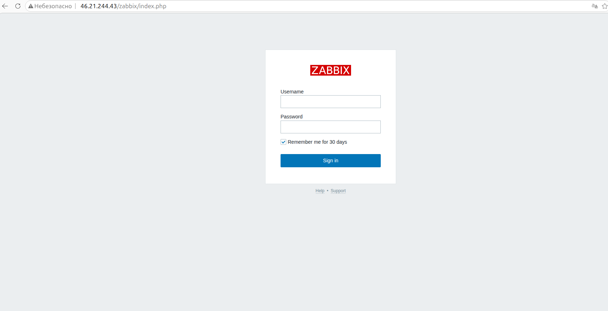
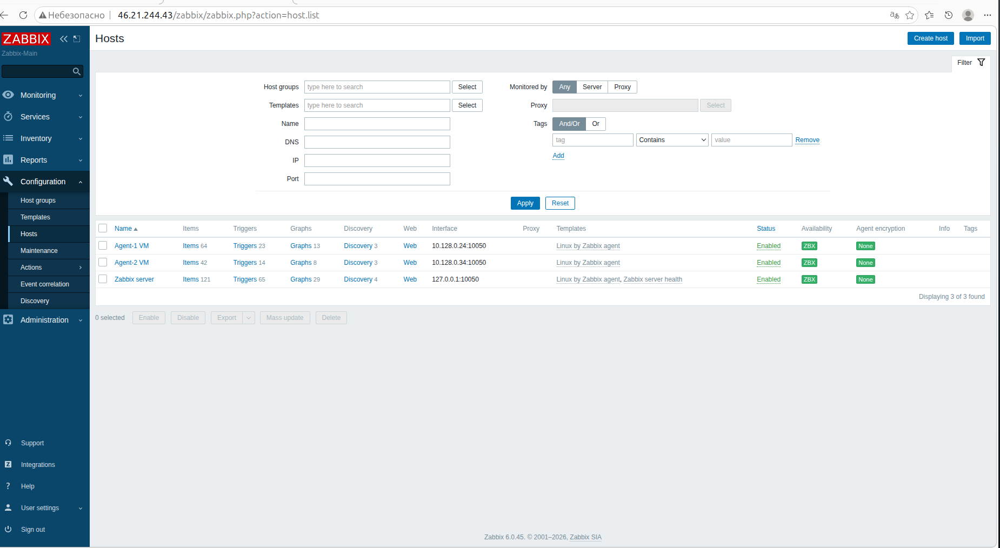
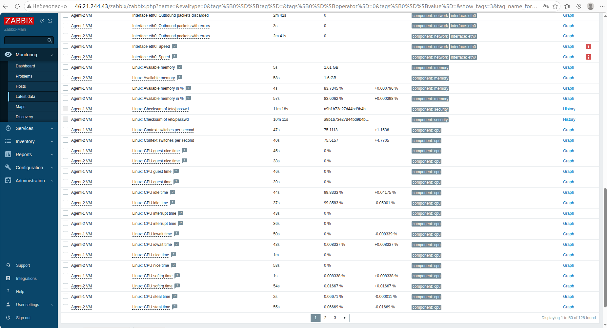

# 📊 ОТЧЁТ ПО ЛАБОРАТОРНОЙ РАБОТЕ
## Развёртывание системы мониторинга Zabbix 6.0 LTS в Yandex Cloud

---

## 👤 СТУДЕНТ

| Поле | Значение |
|------|----------|
| **ФИО** | [Захаров И.А.] |
| **Группа** | [fops-45] |
| **Дата выполнения** | [17.03.2026] |

---

## 🎯 ЦЕЛЬ РАБОТЫ

Развернуть систему мониторинга Zabbix 6.0 LTS, настроить сбор метрик с двух агентских узлов.

---

## 📋 ВЫПОЛНЕННЫЕ ЗАДАЧИ

| № | Задача | Статус | Примечание |
|---|--------|--------|------------|
| 1 | Создать сеть VPC | ✅ | zabbix-network |
| 2 | Создать подсеть | ✅ | 10.128.0.0/24 |
| 3 | Настроить Security Group | ✅ | zabbix-sg |
| 4 | Создать ВМ zabbix-server | ✅ | 2 CPU, 4GB RAM |
| 5 | Создать ВМ agent-1 | ✅ | 2 CPU, 2GB RAM |
| 6 | Создать ВМ agent-2 | ✅ | 2 CPU, 2GB RAM |
| 7 | Установить Zabbix Server 6.0 | ✅ | PostgreSQL |
| 8 | Установить Zabbix Agent2 | ✅ | На обоих агентах |
| 9 | Добавить хосты в Zabbix | ✅ | agent-1, agent-2 |
| 10 | Проверить сбор данных | ✅ | Метрики собираются |

---

## 🖼️ СКРИНШОТЫ

### Скриншот 1: Страница входа Zabbix

**Описание:** Страница авторизации веб-интерфейса Zabbix

**URL:** `http://46.21.244.43/zabbix`

**Учётные данные:**
- Логин: `Admin`
- Пароль: `zabbix`

---

### Скриншот 2: Список хостов (Configuration → Hosts)

**Описание:** Оба агента подключены, статус **ZBX** зелёный

**Хосты:**
| Имя хоста | IP адрес | Статус |
|-----------|----------|--------|
| agent-1 | 10.128.0.24 | 🟢 ZBX |
| agent-2 | 10.128.0.34 | 🟢 ZBX |

---

### Скриншот 3: Собранные данные (Monitoring → Latest data)

**Описание:** Метрики собираются с обоих агентов

**Пример метрик:**
- CPU utilization
- Memory usage
- Disk space
- Network interface speed

---

## ⚙️ КОНФИГУРАЦИЯ

### Параметры ВМ

| ВМ | CPU | RAM | Disk | Internal IP | Public IP |
|----|-----|-----|------|-------------|-----------|
| zabbix-server | 2 | 4 GB | 20 GB | 10.128.0.18 | 46.21.244.43 |
| agent-1 | 2 | 2 GB | 10 GB | 10.128.0.24 | [IP] |
| agent-2 | 2 | 2 GB | 10 GB | 10.128.0.34 | [IP] |

### Настройки Zabbix

| Параметр | Значение |
|----------|----------|
| Версия Zabbix | 6.0.45 LTS |
| База данных | PostgreSQL 14 |
| Веб-сервер | Apache 2.4.52 |
| PHP версия | 8.1 |
| Часовой пояс | Europe/Moscow |

### Security Group Rules

| Direction | Port | Protocol | CIDR | Description |
|-----------|------|----------|------|-------------|
| INGRESS | 80 | TCP | 0.0.0.0/0 | HTTP (Web UI) |
| INGRESS | 22 | TCP | 0.0.0.0/0 | SSH |
| INGRESS | 10050 | TCP | 10.128.0.0/16 | Zabbix Agent Passive |
| INGRESS | 10051 | TCP | 10.128.0.0/16 | Zabbix Agent Active |
| EGRESS | 1-65535 | TCP | 0.0.0.0/0 | All Outbound |
| EGRESS | 1-65535 | UDP | 0.0.0.0/0 | All Outbound |
